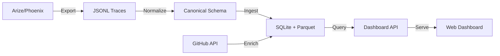

# Arize Dashboard Integration Plan

## Executive Summary
This document outlines the plan to integrate the local dashboard with exported Arize traces from the Dev-Agent-Lens system. The goal is to create a unified observability platform that processes, stores, and visualizes AI agent telemetry data from both Arize and Phoenix backends.

## Current State Analysis

### Existing Infrastructure
1. **Trace Export System**
   - Arize trace export capability via `export_arize.py`
   - Phoenix trace export capability via `export_phoenix.py`
   - Unified export interface via `export_traces.py`
   - JSONL format output with OpenTelemetry-compliant structure

2. **Data Storage Layer**
   - SQLite-based storage (`ProdLensStore`)
   - Parquet file caching for time-series data
   - Dead-letter queue for invalid records

3. **Data Processing Pipeline**
   - Trace normalization (`trace_normalizer.py`)
   - Trace ingestion (`trace_ingestion.py`)
   - GitHub integration for correlating AI usage with development outcomes

4. **Current Dashboard Status**
   - No existing web-based dashboard
   - CLI-based reporting via `prodlens/cli.py`
   - CSV export capability for metrics

## Proposed Architecture

### High-Level Data Flow


## Schema Design

### Base Trace Schema (CanonicalTrace)
The existing `CanonicalTrace` schema will be enhanced to support dashboard requirements:

```python
@dataclass
class CanonicalTrace:
    # Core Fields (existing)
    session_id: Optional[str]
    developer_id: Optional[str]
    timestamp: datetime
    model: Optional[str]
    tokens_in: int
    tokens_out: int
    latency_ms: float
    status_code: Optional[int]
    accepted_flag: bool
    repo_slug: Optional[str]
    diff_ratio: Optional[float]
    accepted_lines: Optional[int]

    # Enhanced Fields (new)
    trace_id: str  # Unique identifier from Arize/Phoenix
    span_id: str   # Span identifier for hierarchical traces
    parent_span_id: Optional[str]  # For trace hierarchy
    service_name: str  # Service identifier (e.g., 'claude-code', 'litellm')
    span_kind: str  # 'LLM', 'TOOL', 'CHAIN', etc.
    tool_name: Optional[str]  # For tool usage spans
    error_message: Optional[str]  # Error details if failed
    cost_usd: float  # Calculated cost based on model pricing
    event_date: str  # ISO date for partitioning
    metadata: dict  # Additional attributes
```

### Aggregated Metrics Schema
For dashboard performance, pre-calculated metrics will be stored:

```python
@dataclass
class DashboardMetrics:
    # Time-based aggregations
    date: date
    hour: Optional[int]

    # Dimensions
    developer_id: Optional[str]
    model: Optional[str]
    service_name: Optional[str]
    repo_slug: Optional[str]

    # Metrics
    total_requests: int
    successful_requests: int
    failed_requests: int
    total_tokens: int
    total_cost_usd: float
    avg_latency_ms: float
    p95_latency_ms: float
    p99_latency_ms: float
    unique_sessions: int
    unique_developers: int

    # Tool usage metrics
    tool_invocations: int
    unique_tools: int
    most_used_tool: Optional[str]

    # Acceptance metrics
    acceptance_rate: float
    accepted_lines_total: int
    diff_ratio_avg: float
```

## ETL Pipeline Design

### Phase 1: Data Extraction
1. **Arize Export Module**
   - Query traces via Arize API with configurable time windows
   - Support incremental exports using watermarks
   - Handle pagination and rate limits
   - Export to JSONL format

2. **Phoenix Export Module**
   - Direct database query from Phoenix
   - Export full trace hierarchies
   - Maintain span relationships

### Phase 2: Data Transformation
1. **Trace Normalization**
   - Map Arize/Phoenix fields to canonical schema
   - Extract nested attributes and metadata
   - Parse tool usage from span attributes
   - Calculate derived metrics (cost, acceptance)

2. **Session Reconstruction**
   - Group spans by trace_id
   - Build trace hierarchies using span relationships
   - Identify session boundaries
   - Associate with developer identities

### Phase 3: Data Loading
1. **Primary Storage (SQLite)**
   ```sql
   CREATE TABLE traces (
       trace_id TEXT PRIMARY KEY,
       span_id TEXT NOT NULL,
       parent_span_id TEXT,
       session_id TEXT,
       developer_id TEXT,
       timestamp TIMESTAMP NOT NULL,
       model TEXT,
       tokens_in INTEGER,
       tokens_out INTEGER,
       latency_ms REAL,
       status_code INTEGER,
       service_name TEXT,
       span_kind TEXT,
       tool_name TEXT,
       cost_usd REAL,
       metadata JSON,
       created_at TIMESTAMP DEFAULT CURRENT_TIMESTAMP
   );

   CREATE INDEX idx_traces_timestamp ON traces(timestamp);
   CREATE INDEX idx_traces_session ON traces(session_id);
   CREATE INDEX idx_traces_developer ON traces(developer_id);
   CREATE INDEX idx_traces_model ON traces(model);
   ```

2. **Time-Series Storage (Parquet)**
   - Partition by date and repository
   - Optimize for analytical queries
   - Enable columnar compression
   - Support incremental updates

3. **Metrics Aggregation**
   - Pre-calculate hourly/daily metrics
   - Update materialized views
   - Maintain rolling windows (7d, 30d, 90d)

## Dashboard Implementation

### Technology Stack
- **Backend**: FastAPI (Python)
  - Async request handling
  - OpenAPI documentation
  - WebSocket support for real-time updates

- **Frontend**: React + TypeScript
  - Material-UI or Ant Design components
  - Recharts for visualizations
  - React Query for data fetching

- **Database**: SQLite + DuckDB
  - SQLite for operational data
  - DuckDB for analytical queries on Parquet files

### Dashboard Features

#### 1. Overview Page
- Total usage metrics (requests, tokens, cost)
- Active developers and sessions
- Model distribution pie chart
- Cost trends over time
- System health indicators

#### 2. Developer Analytics
- Individual developer usage patterns
- Tool usage frequency
- Model preferences
- Cost allocation
- Session timelines

#### 3. Model Performance
- Latency distributions by model
- Token usage patterns
- Error rates and types
- Cost per model comparison
- Acceptance rates

#### 4. Tool Usage Analytics
- Most frequently used tools
- Tool success/failure rates
- Tool chain visualizations
- Performance by tool type

#### 5. Session Explorer
- Detailed session traces
- Span hierarchy visualization
- Request/response inspection
- Error debugging
- Cost breakdown

#### 6. Cost Management
- Cost trends and projections
- Budget alerts configuration
- Cost by developer/team
- Model cost optimization suggestions

#### 7. Real-time Monitoring
- Live trace streaming
- Active session tracking
- Alert notifications
- Performance anomaly detection

### API Endpoints

```python
# Core API endpoints
GET  /api/metrics/overview       # Dashboard overview metrics
GET  /api/metrics/timeseries     # Time-series data for charts
GET  /api/developers              # Developer list and stats
GET  /api/developers/{id}/usage  # Individual developer metrics
GET  /api/models                  # Model usage statistics
GET  /api/tools                   # Tool usage analytics
GET  /api/sessions                # Session list with filters
GET  /api/sessions/{id}          # Detailed session trace
GET  /api/traces/{id}             # Individual trace details
POST /api/alerts                  # Configure alerts
WS   /api/ws/traces               # Real-time trace stream
```

## Implementation Phases

### Phase 1: Data Infrastructure (Week 1-2)
- [ ] Enhance trace normalization for Arize-specific fields
- [ ] Implement incremental export capability
- [ ] Create enhanced database schema
- [ ] Set up Parquet partitioning
- [ ] Build metrics aggregation pipeline

### Phase 2: API Development (Week 2-3)
- [ ] Scaffold FastAPI application
- [ ] Implement core API endpoints
- [ ] Add authentication/authorization
- [ ] Create WebSocket handlers
- [ ] Write API tests

### Phase 3: Dashboard Frontend (Week 3-4)
- [ ] Set up React application
- [ ] Implement overview dashboard
- [ ] Create developer analytics page
- [ ] Build session explorer
- [ ] Add real-time monitoring

### Phase 4: Advanced Features (Week 4-5)
- [ ] Implement cost management features
- [ ] Add alerting system
- [ ] Create tool chain visualizations
- [ ] Build performance optimization recommendations

### Phase 5: Testing & Deployment (Week 5-6)
- [ ] End-to-end testing
- [ ] Performance optimization
- [ ] Docker containerization
- [ ] Documentation
- [ ] Deployment automation

## Performance Considerations

### Data Volume Estimates
- Expected trace volume: 10,000-100,000 traces/day
- Storage requirements: ~1GB/day raw, ~100MB/day compressed
- Query performance target: <100ms for dashboard queries

### Optimization Strategies
1. **Data Partitioning**
   - Partition by date for time-series queries
   - Separate hot/cold data storage
   - Archive old data to S3/GCS

2. **Caching**
   - Redis for frequently accessed metrics
   - In-memory caching for dashboard queries
   - Pre-computed aggregations

3. **Query Optimization**
   - Materialized views for complex aggregations
   - Indexed columns for common filters
   - DuckDB for analytical queries on Parquet

## Security & Compliance

### Data Protection
- Encrypt sensitive data at rest
- Implement row-level security for multi-tenant access
- Audit logging for all data access

### Access Control
- OAuth2/OIDC integration
- Role-based access control (RBAC)
- API key management for programmatic access

### Compliance
- GDPR-compliant data retention policies
- PII redaction in traces
- Data export capabilities for compliance requests

## Monitoring & Alerting

### System Monitoring
- Dashboard application health
- Database performance metrics
- ETL pipeline status
- API response times

### Business Alerts
- Cost threshold alerts
- Error rate spikes
- Unusual usage patterns
- Model performance degradation

## Success Metrics

### Technical Metrics
- Dashboard load time <2s
- API response time <100ms
- 99.9% uptime
- Zero data loss in ETL

### Business Metrics
- Developer adoption rate >80%
- Cost visibility improvement
- Error detection time reduction
- Model usage optimization

## Risk Mitigation

### Technical Risks
- **Data volume scaling**: Use horizontal partitioning
- **Query performance**: Implement caching and pre-aggregation
- **Data quality**: Add validation and dead-letter queues

### Operational Risks
- **Dependency failures**: Implement circuit breakers
- **Data loss**: Regular backups and replication
- **Security breaches**: Regular security audits

## Next Steps

1. **Immediate Actions**
   - Review and approve this plan
   - Set up development environment
   - Create project repository
   - Assign development resources

2. **Week 1 Deliverables**
   - Enhanced trace schema implementation
   - ETL pipeline prototype
   - Basic API scaffolding

3. **Success Criteria**
   - Working dashboard with core features
   - Processing 100% of Arize traces
   - Sub-second dashboard response times
   - Positive user feedback from pilot users

## Appendix

### A. Example Arize Trace Structure
```json
{
  "name": "Claude_Code_Internal_Prompt_1",
  "span_kind": "LLM",
  "parent_id": "a2098f81afb6a645",
  "start_time": 1760358832941,
  "end_time": 1760358832941,
  "status_code": "OK",
  "context.span_id": "1ad3bbf40da0519f",
  "context.trace_id": "bb2aa8f202c802b458ea4fc646967fc7",
  "attributes.llm.provider": "anthropic",
  "attributes.llm.model_name": "claude-opus-4-20250514",
  "attributes.llm.token_count.prompt": 1500,
  "attributes.llm.token_count.completion": 250,
  "attributes.llm.token_count.total": 1750
}
```

### B. Technology Dependencies
- Python 3.11+
- FastAPI 0.100+
- React 18+
- SQLite 3.40+
- DuckDB 0.9+
- Pandas 2.0+
- Apache Arrow/Parquet

### C. Related Documentation
- [Arize API Documentation](https://docs.arize.com/api)
- [Phoenix Trace Format](https://docs.arize.com/phoenix)
- [OpenTelemetry Trace Specification](https://opentelemetry.io/docs/reference/specification/trace/)
- [Dev-Agent-Lens Architecture](README.md)

## Parallel Implementation Tasks for Claude-Code Agents

### Parallel Work Stream Setup

#### Stream 1: Data Infrastructure & ETL Pipeline
```bash
# Create worktree for data infrastructure work
git worktree add -b feature/data-infrastructure ../dev-agent-lens-data-infra

# Agent Execution Prompt:
# "Implement the data infrastructure and ETL pipeline as described in the integration plan below.
# Focus on Phase 1 tasks: enhanced trace normalization, incremental export, database schema,
# Parquet partitioning, and metrics aggregation. Work in the feature/data-infrastructure branch.
# Reference the schemas and ETL pipeline design sections of the plan."
```

#### Stream 2: API Backend Development
```bash
# Create worktree for API backend work
git worktree add -b feature/api-backend ../dev-agent-lens-api

# Agent Execution Prompt:
# "Implement the FastAPI backend service as described in the integration plan below.
# Focus on Phase 2 tasks: scaffold FastAPI app, implement core endpoints, add authentication,
# create WebSocket handlers, and write tests. Work in the feature/api-backend branch.
# Reference the API endpoints and technology stack sections of the plan."
```

#### Stream 3: Dashboard Frontend
```bash
# Create worktree for frontend dashboard work
git worktree add -b feature/dashboard-frontend ../dev-agent-lens-frontend

# Agent Execution Prompt:
# "Implement the React dashboard frontend as described in the integration plan below.
# Focus on Phase 3 tasks: React app setup, overview dashboard, developer analytics,
# session explorer, and real-time monitoring. Work in the feature/dashboard-frontend branch.
# Reference the dashboard features and technology stack sections of the plan."
```

#### Stream 4: Testing & Documentation
```bash
# Create worktree for testing and documentation work
git worktree add -b feature/testing-docs ../dev-agent-lens-testing

# Agent Execution Prompt:
# "Create comprehensive tests and documentation as described in the integration plan below.
# Focus on integration tests, performance benchmarks, API documentation, and user guides.
# Work in the feature/testing-docs branch. Reference all sections of the plan for coverage."
```

### Detailed Parallel Tasks

#### 🔷 Stream 1: Data Infrastructure & ETL Pipeline Tasks

**Task 1.1: Enhanced Trace Schema**
```python
# File: scripts/src/prodlens/schemas_v2.py
# Implement the enhanced CanonicalTrace with new fields:
# - trace_id, span_id, parent_span_id
# - service_name, span_kind, tool_name
# - error_message, metadata
# Maintain backward compatibility with existing schema
```

**Task 1.2: Arize-Specific Normalizer**
```python
# File: scripts/src/prodlens/arize_normalizer.py
# Create normalizer for Arize-specific trace format
# - Handle nested span hierarchies
# - Extract tool usage from attributes
# - Parse LLM-specific metadata
# - Calculate cost based on model pricing
```

**Task 1.3: Database Migration**
```sql
# File: scripts/migrations/001_enhanced_schema.sql
# Create migration script for enhanced schema
# - Add new tables for traces and metrics
# - Create indexes for performance
# - Set up materialized views for aggregations
```

**Task 1.4: Metrics Aggregation Pipeline**
```python
# File: scripts/src/prodlens/metrics_aggregator.py
# Implement metrics pre-calculation:
# - Hourly/daily aggregations
# - Developer usage rollups
# - Model performance statistics
# - Cost calculations
```

**Task 1.5: Parquet Partitioner**
```python
# File: scripts/src/prodlens/parquet_manager.py
# Implement intelligent partitioning:
# - Date-based partitioning
# - Repository-based sharding
# - Compression optimization
# - Incremental updates
```

#### 🔶 Stream 2: API Backend Tasks

**Task 2.1: FastAPI Application Scaffold**
```python
# File: api/main.py
# Set up FastAPI application:
# - CORS configuration
# - Exception handlers
# - Middleware setup
# - OpenAPI documentation
```

**Task 2.2: Core API Endpoints**
```python
# File: api/routers/metrics.py
# Implement metrics endpoints:
# - GET /api/metrics/overview
# - GET /api/metrics/timeseries
# - Caching layer with Redis
# - Query optimization with DuckDB
```

**Task 2.3: Developer Analytics API**
```python
# File: api/routers/developers.py
# Implement developer endpoints:
# - GET /api/developers
# - GET /api/developers/{id}/usage
# - Cost allocation logic
# - Usage pattern analysis
```

**Task 2.4: Session & Trace APIs**
```python
# File: api/routers/sessions.py
# Implement trace exploration:
# - GET /api/sessions with filtering
# - GET /api/sessions/{id} with full trace
# - GET /api/traces/{id} for details
# - Span hierarchy reconstruction
```

**Task 2.5: WebSocket Real-time Stream**
```python
# File: api/websocket/trace_stream.py
# Implement WebSocket handler:
# - Real-time trace streaming
# - Session activity monitoring
# - Alert notifications
# - Connection management
```

**Task 2.6: Authentication & Authorization**
```python
# File: api/auth/security.py
# Implement auth system:
# - JWT token validation
# - OAuth2/OIDC integration
# - Role-based access control
# - API key management
```

#### 🔵 Stream 3: Dashboard Frontend Tasks

**Task 3.1: React Application Setup**
```typescript
// File: frontend/src/App.tsx
// Initialize React application:
// - Material-UI or Ant Design setup
// - React Router configuration
// - React Query setup
// - WebSocket client initialization
```

**Task 3.2: Overview Dashboard**
```typescript
// File: frontend/src/pages/Overview.tsx
// Implement main dashboard:
// - Usage metrics cards
// - Cost trend charts (Recharts)
// - Model distribution pie chart
// - Active session counter
// - System health indicators
```

**Task 3.3: Developer Analytics Page**
```typescript
// File: frontend/src/pages/DeveloperAnalytics.tsx
// Create developer insights:
// - Developer selection/search
// - Usage timeline visualization
// - Tool frequency heatmap
// - Cost breakdown table
// - Model preference charts
```

**Task 3.4: Session Explorer**
```typescript
// File: frontend/src/pages/SessionExplorer.tsx
// Build trace exploration:
// - Session list with filters
// - Trace hierarchy tree view
// - Request/response viewer
// - Error debugging panel
// - Performance waterfall chart
```

**Task 3.5: Real-time Monitor**
```typescript
// File: frontend/src/pages/LiveMonitor.tsx
// Implement live monitoring:
// - WebSocket connection
// - Live trace feed
// - Active session tracker
// - Alert notification system
// - Performance metrics dashboard
```

**Task 3.6: Cost Management Dashboard**
```typescript
// File: frontend/src/pages/CostManagement.tsx
// Create cost tracking:
// - Budget configuration
// - Cost projection charts
// - Team cost allocation
// - Model cost comparison
// - Optimization recommendations
```

#### 🔴 Stream 4: Testing & Documentation Tasks

**Task 4.1: ETL Pipeline Tests**
```python
# File: tests/test_etl_pipeline.py
# Test data pipeline:
# - Trace normalization tests
# - Schema validation tests
# - Aggregation accuracy tests
# - Performance benchmarks
```

**Task 4.2: API Integration Tests**
```python
# File: tests/test_api_integration.py
# Test API endpoints:
# - End-to-end API tests
# - WebSocket connection tests
# - Authentication flow tests
# - Rate limiting tests
```

**Task 4.3: Frontend Component Tests**
```typescript
// File: frontend/src/__tests__/
// Test React components:
// - Component rendering tests
// - User interaction tests
// - Data fetching tests
// - WebSocket event tests
```

**Task 4.4: Performance Benchmarks**
```python
# File: benchmarks/performance.py
# Benchmark system:
# - Query performance tests
# - Load testing (Locust)
# - Memory usage profiling
# - Concurrent user simulations
```

**Task 4.5: Documentation**
```markdown
# Files: docs/
# Create documentation:
# - API reference (auto-generated)
# - User guide
# - Deployment guide
# - Architecture diagrams
# - Troubleshooting guide
```

### Execution Coordination

#### Dependency Matrix
```yaml
dependencies:
  stream2_api:
    depends_on: [stream1_data.task_1_1, stream1_data.task_1_3]
  stream3_frontend:
    depends_on: [stream2_api.task_2_1, stream2_api.task_2_2]
  stream4_testing:
    can_start: immediately
    full_coverage_after: [stream1, stream2, stream3]
```

#### Merge Strategy
```bash
# After parallel work completion:
git checkout main
git merge feature/data-infrastructure
git merge feature/api-backend
git merge feature/dashboard-frontend
git merge feature/testing-docs

# Or create a PR for each branch for review
gh pr create --base main --head feature/data-infrastructure
gh pr create --base main --head feature/api-backend
gh pr create --base main --head feature/dashboard-frontend
gh pr create --base main --head feature/testing-docs
```

### Success Criteria for Each Stream

**Stream 1 Success:**
- ✅ All traces normalize without data loss
- ✅ Parquet files properly partitioned
- ✅ Metrics aggregate correctly
- ✅ Database queries < 100ms

**Stream 2 Success:**
- ✅ All API endpoints return correct data
- ✅ WebSocket streams work reliably
- ✅ Authentication properly secured
- ✅ API response time < 100ms

**Stream 3 Success:**
- ✅ Dashboard loads in < 2 seconds
- ✅ All charts render correctly
- ✅ Real-time updates work smoothly
- ✅ Responsive on mobile devices

**Stream 4 Success:**
- ✅ 80% code coverage achieved
- ✅ All integration tests pass
- ✅ Performance benchmarks met
- ✅ Documentation complete and clear